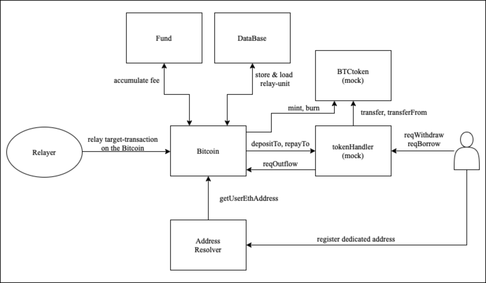

# BiFi-Bifrost-Extension Contract

### BiFi (Bifrost Finance)
**BiFi** is the multichain DeFi (Decentralized Finance) project built on Ethereum, Binance Smart Chain (BSC) and Avalanche. The BiFi lending protocol allows users to **deposit** digital assets to earn interest and **borrow** against the deposits as collateral. Users can also **withdraw** the deposited assets or **repay** their loans. Initially, BiFi only supported connectivity of EVM-based blockchains. BiFi-Bifrost-Extension Contract supports both EVM-based and non-EVM-based blockchains (most notably Bitcoin) for the first time in DeFi helping create products and services that can interoperate across multiple blockchains.

### BiFi-Bifrost-Extension Contract
Bifrost-BiFi extension is an expansion of the BiFi lending protocol. It allows native cross-chain lending between Bitcoin blockchain and EVM-based blockchain (e.g. Ethereum or Binance Smart Chain) using the BTC-Relay protocol to securely transfer and prove an event from one blockchain to another. As a result, a user who holds BTC will be able to borrow any digital assets supported on BiFi lending (including native BTC), earn interest on deposits, and earn BiFi token rewards.
A Smart Contracts that interacts with all Bifrost-BiFi Extention components are implemented in this Repository.

### Smart Contracts of the BiFi-Bifrost-Extension Contract
All smart contracts (represented by white squares in the figure below) can be deployed on any EVM-based blockchains since these are implemented in Solidity.

##### **_AddressResolver contract_** (found on contracts/resolver/)
The AddressResolver contract stores maps between a user's Bitcoin addresses and Ethereum address.

##### **_Bitcoin contract_** (found on contracts/bitcoin/)
The Bitcoin contract verifies the relayed data with the attached cryptographic proof. Next, it finalizes the relayed data after several confirmations (the number of confirmation is set as the system parameter). After the task for BiFi lending included in the relayed data is finalized, the Bitcoin contract calls proper methods of BiBTC Handler contract.

##### **_BiBTC Handler contract_** (found on contracts/HandlerEntry.sol)
BiBTC Handler that is also known as "tokenHandler" of BiFi Lending manages and executes BiFi lending service (e.g. Deposit, Repay)

***
### BiFi (Bifrost Finance)
BiFi는 이더리움, 바이낸스 체인(Binance Smart Chain)과 아발란체(Avalanche)에서 서비스 중인 멀티체인 DeFi입니다.
사용자는 BiFi Lending 프로토콜을 통해 가상화폐를 **예금**하여 예금 이자를 얻을 수 있고, 예금을 담보로 암호화폐를 대출 받을 수도 있습니다. 물론 예금한 암호화폐를 자유롭게 인출하거나 대출을 상환할수 있습니다. 초기 버전의 BiFi는 EVM 기반 블록체인에서만 Lending 서비스가 가능했지만, 이제 BiFi-Bifrost-Extension Contract를 통해 비트코인까지 서비스 범위가 확장됩니다.

### BiFi-Bifrost-Extension Contract
BiFi-Bifrost-Extension Contract는 Bitcoin 블록체인에서 발생한 이벤트를 EVM 기반 블록체인으로 전달하는 BTC-Relay 방식으로 비트코인과 EVM 기반 블록체인 (이더리움, BSC, Avalanche 등) 간에 크로스체인(cross-chain) Lending 서비스를 가능하게 합니다. 그 결과, 사용자는 자신의 비트코인을 BiFi에 예금하여 다른 암호 화폐를 대출하거나, 다른 암호 화폐 예금을 담보로 비트코인을 대출 받을 수 있습니다.
여기서는 BiFi-Bifrost-Extension Contract 프로토콜 구성원들과 상호작용하는 스마트 컨트랙트에 대해 다룹니다.

### Smart Contracts of the BiFi-Bifrost-Extension Contract
아래 하얀 박스로 표현된 모든 스마트 컨트랙트는 Solidity로 구현되어, 모든 EVM 기반 블록체인에 설치될 수 있습니다.

##### **_AddressResolver contract_** (found on contracts/resolver/)
AddressResolver 컨트랙트는 각 사용자의 전용 비트코인 주소들과 사용자의 이더리움 주소에 대한 맵핑을 저장합니다.

##### **_Bitcoin contract_** (found on contracts/bitcoin/)
Bitcoin 컨트랙트는 암호학적 증명과 함께 제출된 데이터를 검증하고 정해진 블록 수가 지난 후에 제출된 데이터를 확정합니다. 그리고 Bitcoin 컨트랙트는 확정된 데이터를 BiBTC Handler 컨트랙트의 적절한 함수에 전달하여 BiFi Lending을 완료합니다.

##### **_BiBTC Handler contract_** (found on contracts/HandlerEntry.sol)
기존 BiFi의 "tokenHandler"의 한 종류인 BiBTC Handler는 BiFi lending 서비스(에금 및 인출, 대출 및 상환)를 실질적으로 실행하는 컨트랙트 입니다.